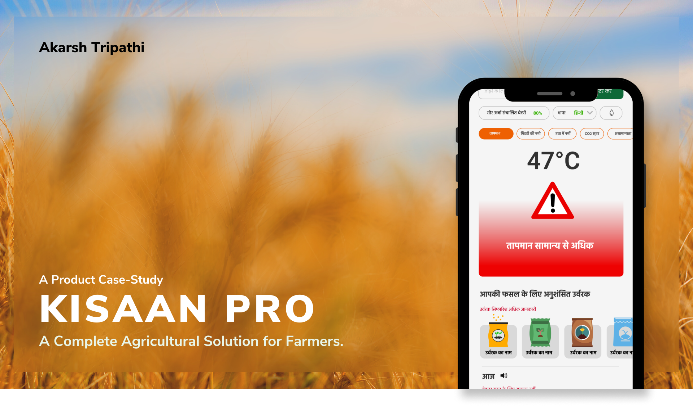
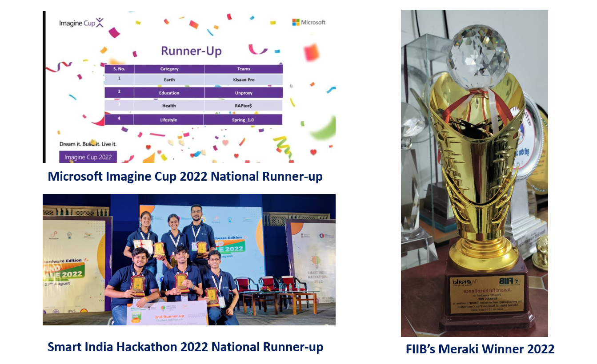
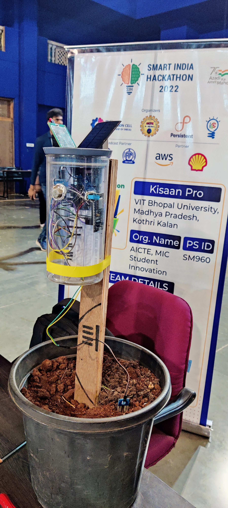
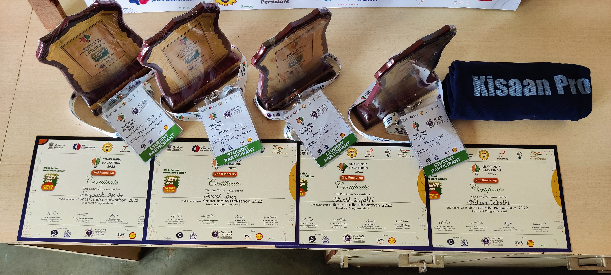

 

  <h3 align="center">Kisaan Pro 
(Microsoft Imagine Cup'22 National RunnerUp)</h3>
<!--  -->

  

    An ML-based Agrotech product to help farmers grow more!  
     
     
    <a href="https://github.com/akarsh-tripathi/Team_KisaanPro">View Demo</a>
    .
  

  

## Table Of Contents

* [About the Project](#about-the-project)
* [Built With](#built-with)
* [Contributing](#contributing)
* [License](#license)

## About The Project

Won 3 National Titles for being the most cost-effective & Innovative Product 

* National Runnerup 2'nd - Microsoft Imagine Cup 2022
* National Runnerup - Smart India Hackathon, Govt. of India 
* National Runner up - Meraki B-Plan Challenge

According to UN Report, We are moving towards a global food & water crisis in the next 100 years if we didn't make our farming more tech advances & make the best use of technology. 

Especially in India, the farmers are lacking the specific use of agrotech advancements and ML due to many factors
* 2G network availability 
* Lowend devices that do not support high-functionality applications 
* Regular Power cut off in most parts of areas.
* Language & Geography keeps on changing every 100 kms 
* No information about Agrotech infrastructure
* Delay in taking action in cases of Field fires 

The Solution:

* Building IOT Product that will even run on a 2G Network and can send data seamlessly 
* ML-based Irrigations recommendations using Real-Time Data.
* UI that can run on low-end devices and can be used to transfer data at an ultimate constant speed.
* Use of camera to detect pesticides in the farm and give 80% accurate analysis using the fast & low accuracy ML model (VGG16) and an ML model that give accurate result and recommendations using the same in the next hour (In the view of low-speed upload)

The application was built using some key points that keep the UX of Farmers in mind-
* Visible in Broad daylight 
* Using of skeleton-based model for the UI and fast rendering
* Using color-coded schemes to make the use of the application super easy & useful
* Use of Graphics to make the user understand the application usage

## Built With

The Hardware is built on top of an Arduino UNO Microcontroller with - 
* ESP8266 for wifi & Bluetooth communications 
* GSM/GPRS module for 2 G-based communications 
*  DHT11 sensor for temperature and humidity, FC 37 for rain sensor
* JXCT soil NPK sensor 
* MQ135 sensor for CO2 and fumes detection in case of wildfires
* ‎RB-1124 relay module for pump on/off
* Solar panel for self-power generations 

The Software was built on top of 
* Blazor Framework (Server Side rendering)
* Used C# as interface language
* The messaging service used is Twilio 
* Postman for API connection b/w database & hardware 
* Azure for hosting applications & databases for instant data!

## Contributing

Contributions are what make the open-source community such an amazing place to learn, inspire, and create. Any contributions you make are **greatly appreciated**.
* If you have suggestions for adding or removing projects, feel free to [open an issue](https://github.com/akarsh-tripathi/Team_KisaanPro/issues/new) to discuss it, or directly create a pull request after you edit the *README.md* file with necessary changes.
* Please make sure you check your spelling and grammar.
* Create individual PR for each suggestion.
* Please also read through the [Code Of Conduct](https://github.com/akarsh-tripathi/Team_KisaanPro/blob/main/CODE_OF_CONDUCT.md) before posting your first idea as well.

### Creating A Pull Request

1. Fork the Project
2. Create your Feature Branch (`git checkout -b feature/AmazingFeature`)
3. Commit your Changes (`git commit -m 'Add some AmazingFeature'`)
4. Push to the Branch (`git push origin feature/AmazingFeature`)
5. Open a Pull Request

## License

Distributed under the MIT License. See [LICENSE](https://github.com/akarsh-tripathi/Team_KisaanPro/blob/main/LICENSE.md) for more information.

